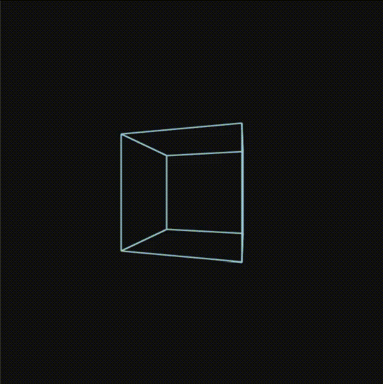

# 3D Wireframe Canvas

A lightweight, "from scratch" 3D engine built with pure JavaScript and HTML5 Canvas. This project demonstrates how to project 3D vertices onto a 2D screen using perspective division and rotation matrices.

  

## ✨ Features
* **Perspective Projection:** Simulates depth by dividing coordinates by their distance ($Z$).
* **Real-time Rotation:** Uses trigonometric functions to rotate vertices in 3D space.
* **Wireframe Rendering:** Connects vertices using the HTML5 Canvas API to form a 3D cube.
* **Zero Dependencies:** No Three.js or WebGL—just math.

## 🚀 Quick Start
1. Clone this repository.
2. Open `index.html` in any modern web browser.
3. Watch the wireframe cube rotate in real-time.

## 🛠️ How it Works
* **`cube.js`**: Defines the vertices (points) and faces (edges) of the cube.
* **`index.js`**: 
    * **Math**: Handles the `rotate_xz` and `project` logic.
    * **Rendering**: Maps the normalized 3D coordinates to the actual pixel width/height of your screen.
    * **Loop**: Runs at 60 FPS using `setTimeout`.

